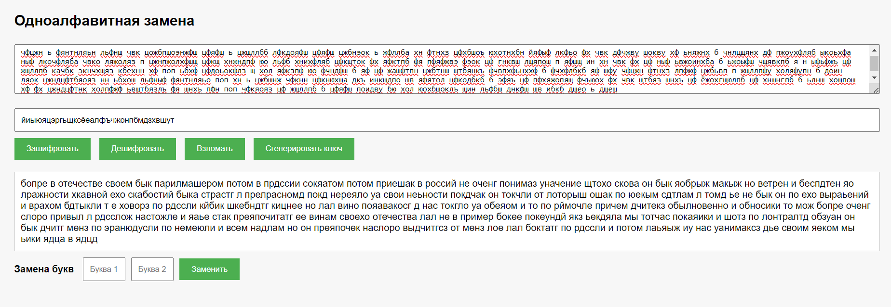
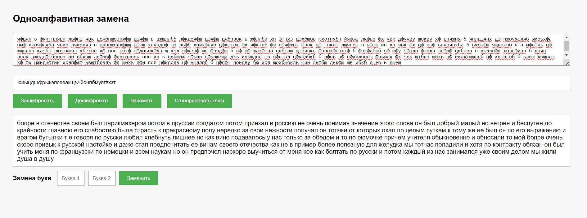

# Шифр одноалфавитной замены

## Описание
Этот проект представляет собой учебное приложение, демонстрирующее шифрование методом одноалфавитной замены. Он включает в себя веб-интерфейс и серверную часть, обрабатывающую запросы.

## Структура проекта
- **Handlers/**
  - `WebSocketHandler.cs`: Обработчик WebSocket-соединений.
- **Models/**
  - `RequestMessage.cs`: Модель запроса.
  - `ResponseMessage.cs`: Модель ответа.
- **Services/**
  - `CipherService.cs`: Сервис для выполнения шифрования.
- **wwwroot/**
  - `index.html`: Главная страница веб-приложения.
  - `script.js`: Скрипты для взаимодействия с сервером.
  - `style.css`: Стили для веб-приложения.
- `Program.cs`: Точка входа в приложение.
- `Startup.cs`: Конфигурация приложения.

## Запуск проекта
Для запуска проекта выполните следующие шаги:

1. Убедитесь, что у вас установлен .NET 8.0 SDK.
2. Откройте терминал и перейдите в корневую директорию проекта.
3. Выполните команду:
    ```sh
    dotnet run
    ```
4. Откройте браузер и перейдите по адресу `http://localhost:5000`.

### Что можно сделать в веб-интерфейсе?
1. Ввести текст для шифрования
2. Сгенерировать ключ или ввести его самому
3. Получить зашифрованный текст
4. Расшифровать текст, имея ключ
5. Взломать зашифрованный текст при помощи частотного анализа (полуавтоматический режим)
6. Вручную менять буквы "взломанного" ключа, используя функционал на сайте

## Инструкция по взлому шифра.
1. Вставить зашифрованный текст в первое поле
2. Нажать кнопку "Взломать" - в поле ключа появится "взломанный" ключ на основе частотного анализа, он не идеален
3. Внизу после всех полей появились 2 поля и кнопка для замены букв во взломанном ключе
4. Нажимаем кнопку "Зашифровать" - звучит глупо, но так устроен шифр. Если вставлен взломанный ключ, текст будет дешифроваться.
4. Глазами смотрим на расшифрованный текст и цепляемся за слова, которые почти правильно расшифровались. (Например третье слово "отеьестпе" в тестовом предложенном примере, скорее всего должно было получиться слово "отечестве". Делаем вывод, что 'ь' это 'ч')
5. Вводим 'ь' и 'ч' в поля для замены букв, нажимаем кнопку "Заменить"
6. Смотрим на полученный текст и продолжаем до тех пор, пока не решим остановиться.

## Текст для примера. Взят отрывок из Капитанской Дочки А. С. Пушкина
** Бопре в отечестве своем был парикмахером потом в Пруссии солдатом потом приехал в Россию не очень понимая значение этого слова Он был добрый малый но ветрен и беспутен до крайности Главною его слабостию была страсть к прекрасному полу нередко за свои нежности получал он толчки от которых охал по целым суткам К тому же не был он по его выражению и врагом бутылки т е говоря по русски любил хлебнуть лишнее Но как вино подавалось у нас только за обедом и то по рюмочке причем учителя обыкновенно и обносили то мой Бопре очень скоро привык к русской настойке и даже стал предпочитать ее винам своего отечества как не в пример более полезную для желудка Мы тотчас поладили и хотя по контракту обязан он был учить меня по французски по немецки и всем наукам но он предпочел наскоро выучиться от меня кое как болтать по русски и потом каждый из нас занимался уже своим делом Мы жили душа в душу **

## Скриншоты






## Контакты
Если у вас есть вопросы или предложения, пожалуйста, свяжитесь со мной по электронной почте: `alexmosin@inbox.ru`.